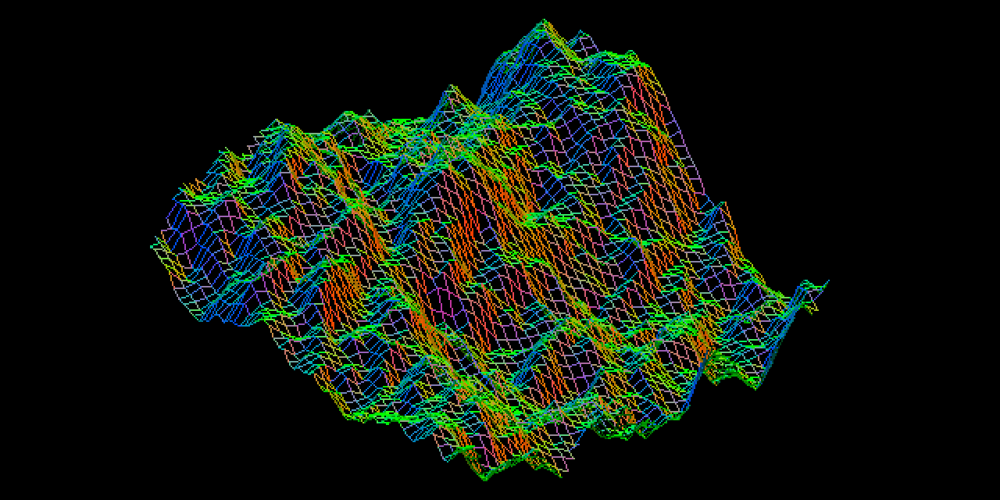
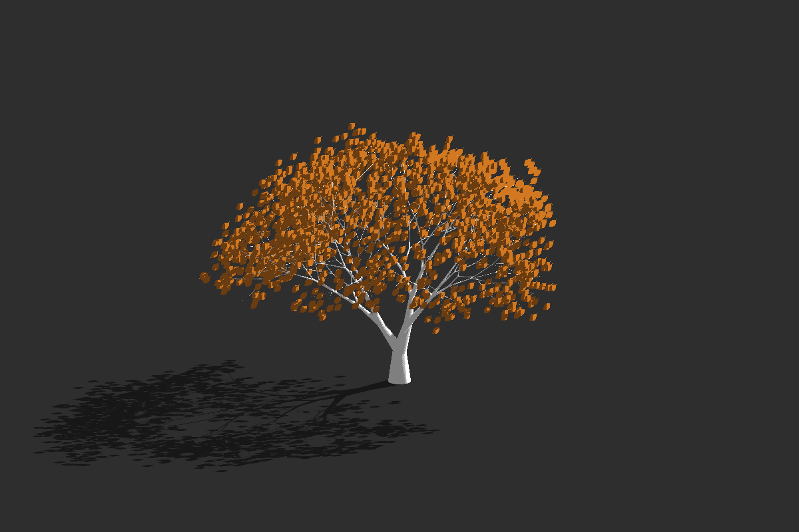
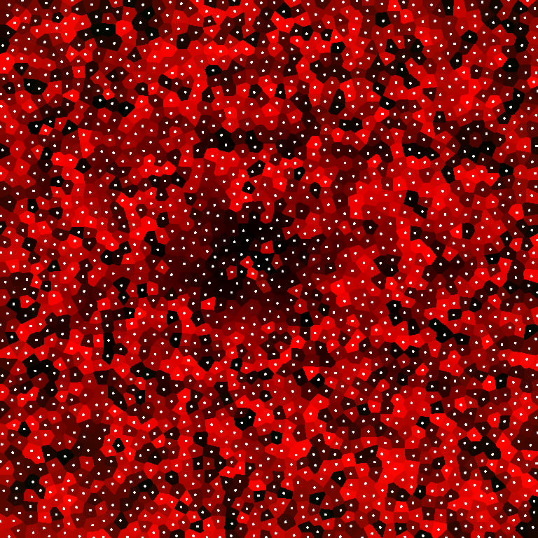

# TinyEngine

Small OpenGL based 2D/3D Engine / Wrapper in C++

Supported on GNU/Linux and MacOS


Simple generated perlin-noise heightmap rendered with normal vectors as colors (Example Program 2)

	LINES OF CODE (without unreasonable compression):

		Main File: 188
		Main Classes: 302
		Utility Classes: 775
		Helpers Namespaces: 678
		Core Total: 1265
		Total: 1943

	History:
		12. Apr 2020: 885
		29. Apr 2020: 1116
		17. May 2020: 1667
		23. May 2020: 1065
 		01. Aug 2020: 1145
		21. Feb 2021: 1378
		27. Jul 2021: 1943

## Description
Based on many previous OpenGL projects, I have a good idea of what features I need in an engine to build visually appealing visualizations of generated data. Many of the projects had the same overarching structure, and used the same OpenGL wrapping structures. This engine unifies those basic concepts.

The goal of this "engine" is to act as an intuitive wrapper for boilerplate OpenGL, allowing for quick and easy development of 2D / 3D visualizations of generated data. I also want to keep it as small as possible, giving only necessary abstractions of boilerplate OpenGL code, and doing the rest with user-defined behaviors passed to the engine.

This is also a learning project, for practicing engine / systems design. This is not intended as an optimized game development library, but can be used to generate beatiful visualizations of generated data.

If anybody likes the structure, they are free to adopt it or recommended additions / changes.

As I continue to build projects using this engine, I plan on slowly expanding its feature set, as long as new features fit elegantly into the overall structure and offer a large amount of functionality for little additional effort.


Animated Julia-Set (Example 4). See my blog [here](https://weigert.vsos.ethz.ch/2020/04/14/animated-multi-julia-sets/).

## Structure
The main engine interface is wrapped in a namespace `Tiny`. This namespace has three (global) static members, which are its main component classes:

	- View Class (Tiny::view):       Window handling, rendering, GUI interface
	- Event Class (Tiny::event):     Event handling for keyboard and mouse, window resizing
	- Audio Class (Tiny::audio):     Audio interface for playing / looping sounds

A number of utility classes wrap typical OpenGL features into easily useable structures. These have simple constructors and destructors that wrap the necessary OpenGL so you don't have to worry about it:

	- Texture:      OpenGL texture wrapper with constructors for different data types (e.g. algorithm, raw image, ...)
	- Shader:       Load, compile, link and use shader programs (vertex, fragment, geometry) easily, pass SSBO.
	- Compute:      Derived from Shader, allows for compute shader dispatching
	- Buffer:				OpenGL Buffer Object wrapper. Allows for easy templated loading and data retrieval for the GPU.
	- Model:        OpengL VAO/VBO wrapper. Construct from user-defined algorithm. Handles loading, updating, rendering.
	- Target:       OpenGL FBO wrapper. Bind a texture for render targeting. Handles 2D (billboards) and 3D (cubemaps).
	- Instance:     OpenGL instanced rendering wrapper (any Model object, any data). Simply add model buffers and render model instanced.

More information can be found on the wiki: [Utility Classes](https://github.com/weigert/TinyEngine/wiki/Utility-Classes)

The behavior is combined through a standard game pipeline. The programs behavior is additionally changed through user-defined functions which are called in the relevant parts of the pipeline:

	- Tiny::event.handler: 	Lets you define behavior based on user-inputs. Tiny::event stores input data
	- Tiny::view.interface: Lets you define an ImGUI interface that can act on your data structures
	- Tiny::view.pipeline: 	Combines utility classes to render your data structures to targets / windows
	- Tiny::loop: 		Executed every cycle. Arbitrary code acting on your data structures every loop

A number of helper namespaces then supply additional algorithms and functions that are useful.

## Example Images

All of the programs shown below are highly interactive and allow for live manipulation of the scene. All of them run in real time and allow for camera movement. Read the very brief example programs to see how TinyEngine is used to construct nice visualizations using very little code.


A procedural 3D tree (example program 6), that has a leaf particle system and orthogonal projection shadow mapping.


A simple scene (example program 9) that uses .obj / .mtl files generated in Blender, and then uses cubemaps for point-light shading.



An example image of a shader-based voronoi texture generator I implemented as a small experiment (example program 11). Lets you do real-time voronoi filters because its very fast. Here seen for N = 2048. See [my blog here here](https://weigert.vsos.ethz.ch/2020/08/01/gpu-accelerated-voronoi-textures-and-filters/).


A rendering of a dynamic alpha-blended voxel scene which uses a technique called vertex pooling to reduce driver overhead while drawing. See [my blog here](https://weigert.vsos.ethz.ch/2021/04/04/high-performance-voxel-engine/)

## Usage
As the code-base is extremely brief, I recommend reading through the code and the example programs to understand how it works. The Wiki contains more information on the individual functions of the classes and how they are used.

### Constructing a Program
Building a program with TinyEngine is extremely simple!

Example Program 0:

```cpp
#include <TinyEngine/TinyEngine>

int main( int argc, char* args[] ) {

	Tiny::window("Example Window", 600, 400);   //Open Window

	Tiny::event.handler = [&](){ /*...*/ };   //Define Event Handler

	Tiny::view.interface = [&](){ /*...*/ };  //Define ImGUI Interface

	/*...Define Utility Classes...*/

	Tiny::view.pipeline = [&](){ /*...*/ };   //Define Rendering Pipeline

	Tiny::loop([&](){ //Start Main Game Loop
        		//... additional code here
	});

	Tiny::quit(); //Close the window, cleanup

	return 0;
}
```

Check the [TinyEngine Wiki](https://github.com/weigert/TinyEngine/wiki) for more information on how to construct a basic program. Read the example programs to see how the utility classes are combined to create interactive 2D and 3D programs using OpenGL in very little code.

### Compiling and Linking
As of 2021, TinyEngine is built as a statically linked library for easier inclusion in your project. This has a number of benefits:
- TinyEngine does not need to be copied into your project directory
- Easier continuous maintenance and updating
- Faster compilation times

The installation process occurs in the makefile (valid for all operating systems):

```bash
sudo make setup     #Copy Core Header Files to Install Location
sudo make helpers   #Copy Helper Headers
sudo make install   #Compile TinyEngine and Copy to Install Location
sudo make all       #All of the above! Run this for easy install.
```

The default install locations are `/usr/local/lib` for the compiled library and `/usr/local/include` for the header files.

Check the (brief!) makefile for options (e.g. install location, compiler flags).

Note that the installation has only been tested on GNU/Linux and install locations might need tuning for your system.

#### Building a Project
Building a project by default only requires inclusion of the TinyEngine header

```cpp
#include <TinyEngine/TinyEngine>
```

and optionally any helper namespace headers, e.g.

```cpp
//...
#include <TinyEngine/object>
#include <TinyEngine/image>
//...
```

TinyEngine standalone is linked using:

```bash
-lTinyEngine
```

but also requires linking of all additional dependencies! See the example programs to see exactly how to link the program (makefile). Note that all makesfiles are identical! Different operating systems have slightly different linkage.

Compiled using g++ on Ubuntu 18/20 LTS, Fedora 33 and MacOS Big Sur.

#### Compatibility Profile

In case your computer / graphics card does not support the latest versions of OpenGL, you can compile your program by defining the additional macro `TINYENGINE_COMPATIBILITY`, i.e.:

```bash
gcc main.cpp -D TINYENGINE_COMPATIBILITY -o main
```

This will reduce the version to a compatibility version, reducing some features (i.e. lower GLSL versions), but allowing for 95% of all features to operate normally.

Note that some examples rely on features introduced in OpenGL4+, meaning that the required version of GLSL will not be available. All example programs are reduced to the **minimum necessary version**.

#### Shipping Resources

TinyEngine supports the embedded shipping of resources in executables in a native way. It does this by utilizing [c-embed](https://github.com/weigert/c-embed) and desiging file-loading structures to use an `<stdio.h>` style interface. To ship your resources (i.e. shaders, images, .obj files) as embedded in the executable, use the `c-embed` style make rule as follows:

```make
DAT = resource			#resource directory to embed (e.g. /shader/)
.PHONY: embedded
embedded: CEF = $(shell c-embed $(DAT)) c-embed.o -include /usr/local/include/c-embed.h -DCEMBED_TRANSLATE
embedded:
	$(CC) main.cpp $(CF) $(LF) -lTinyEngine $(TINYOS) $(TINYLINK) -o main ${CEF}
```

For a working example, read the `c-embed` documentation and see the TinyEngine examples. All examples have been provided with an embedded rule. Running `make all` results in relative path dependency, while running `make embedded` embeds the resource folder as a virtual filesystem while the code remains entirely unchanged.

Currently Implemented Loading Interfaces:
- Shaders

Not-Yet Implemented Loading Interfaces:
- Images
- Object Files

### Dependencies / Installation

Currently TinyEngine has only been tested on linux (Ubuntu 18 LTS, Fedora 33) and MacOS. It would be possible to port to windows, but I lack a dedicated windows development environment to reliably port it. I might do this in the future.  

#### Debian-Based Systems (e.g. Ubuntu)

    - OpenGL3: apt-get install libglu1-mesa-dev
    - SDL2:    apt-get install libsdl2-dev libsdl2-ttf-dev libsdl2-mixer-dev libsdl2-image-dev
    - GLEW:    apt-get install libglew-dev
    - Boost:   apt-get install libboost-system-dev libboost-filesystem-dev
    - GLM:     apt-get install libglm-dev

    - DearImGUI (already included!)
    - g++ (compiler)

		Optional:

		- c-embed: https://github.com/weigert/c-embed

In a single command:

```bash
sudo apt-get install libglu1-mesa-dev libsdl2-dev libsdl2-ttf-dev libsdl2-mixer-dev libsdl2-image-dev libglew-dev libboost-system-dev libboost-filesystem-dev libglm-dev
```

#### Fedora / DNF Package Manager Systems

For systems with `dnf` as package manager, the dependencies can be installed using:

```bash
sudo dnf install make gcc-c++ glew-devel SDL2-devel SDL2_image-devel SDL2_ttf-devel SDL2_mixer-devel boost-devel glm-devel
```

#### MacOS (+Apple M1)

To install on MacOS, you need to install xcode commandline tools:

```bash
sudo xcode-select --install
```

Then, to install the dependencies, I recommend installing [homebrew from here](https://brew.sh) and installing the packages:

```bash
brew update
brew upgrade
brew install gcc
brew install glew 
brew install sdl2 
brew install sdl2_image 
brew install sdl2_mixer 
brew install sld2_ttf
brew install glm 
brew install boost
```

Note that MacOS only supports a specific OpenGL version, giving access to GLSL versions 330 to 410 (including core profiles). This affects which examples can be run, depending on what GLSL versions they need. Be aware of this when writing your own programs.
(Credit: User CodingWatching)

Note that you might get the following errors if you have `binutils` installed via `homebrew`:

```
ld: warning: ignoring file /usr/local/lib/libTinyEngine.a, building for macOS-arm64 but attempting to link with file built for unknown-unsupported file format ( 0x21 0x3C 0x61 0x72 0x63 0x68 0x3E 0x0A 0x2F 0x20 0x20 0x20 0x20 0x20 0x20 0x20 )
ld: symbol(s) not found for architecture arm64

ld: warning: ignoring file /usr/local/lib/libTinyEngine.a, building for macOS-arm64 but attempting to link with file built for macOS-arm64
```

See the [following issue](https://stackoverflow.com/questions/71285115/cannot-link-library-for-macos-arm64-with-executable-for-macos-arm64) for more information.

Uninstall homebrew binutils to compile correctly.

```bash
brew uninstall binutils
```

#### Windows

I am currently working on an elegant windows port. Stay tuned.

## License
MIT License
